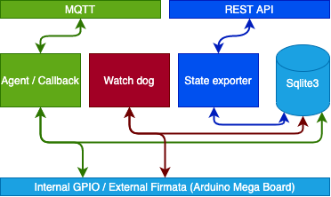

IoT Edge Agent
==============

Suitable platform for Edge Agent:

- Orange Pi Zero 2 with Armbian (tested)
- Raspberry Pi Zero (wip)
- Orange Pi i96 (wip)

Purpose
-------

- Read sensors from GPIO/Firmata and write to MQTT topic
- Read controller MQTT topic (=callback) action from One-green Core (https://github.com/One-Green/core-api-gateway)
  and write to GPIO/Firmata
- If no MQTT message from callback, after certain time delta,
  ensure all GPIO/Firmata are in safety mode (pumps, valves = OFF ...)
- Create and REST API server to get state of sensors, actuator, safety mod, callback updated at, edge agent tag ...

GUI Based deployment
--------------------

Use this project to deploy with an graphical interface : https://github.com/One-Green/iot-edge-wizard

Run Agent
---------

One Edge Agent run these command

.. code-block:: shell

    # Install Python3 and dependencies
    apt update
    apt install python3-dev python3-pip -y
    pip3 install -r requirements.txt
    # install PM2
    wget -qO- https://getpm2.com/install.sh | bash

Example: run water edge agent, configure **water/settings.py**

.. code-block:: python

    # Configure MQTT connexion parameter
    MQTT_HOST: str = os.getenv("MQTT_HOST", "")
    MQTT_PORT: int = int(os.getenv("MQTT_PORT", ""))
    MQTT_USER: str = os.getenv("MQTT_USER", "")
    MQTT_PASSWORD: str = os.getenv("MQTT_PASSWORD", "")

    # You can also set ENV VAR (~/.bashrc / ~/.zshrc)
    export MQTT_HOST=""
    export MQTT_PORT=""
    export MQTT_USER=""
    export MQTT_PASSWORD=""

Once MQTT configured, start agent by using these commands

.. code-block:: shell

    cd water
    pm2 start agent.py --interpreter python3
    pm2 start agent_callback.py --interpreter python3
    pm2 start watchdog.py --interpreter python3
    # REST API Server
    pm2 start state_exporter.py --interpreter python3
    # This command will save this current state
    # allow agent start after linux boot / crash etc
    pm2 save

Water Edge additional hardware requirements
-------------------------------------------

- Flash Arduino nano sonar firmware

Disconnect all USB-TTL and connect only Arduino Nano board

.. code-block:: shell

    cd nano_sonar
    pio update
    pio run -t upload -e nano

- Flash mega firmata firmware

Disconnect all USB-TTL and connect only Arduino Mega board

.. code-block:: shell

    cd mega_firmata
    pio update
    pio run -t upload

